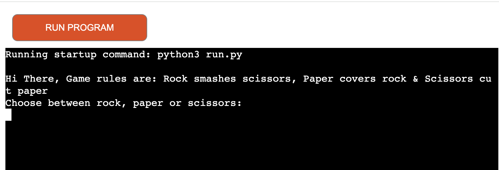
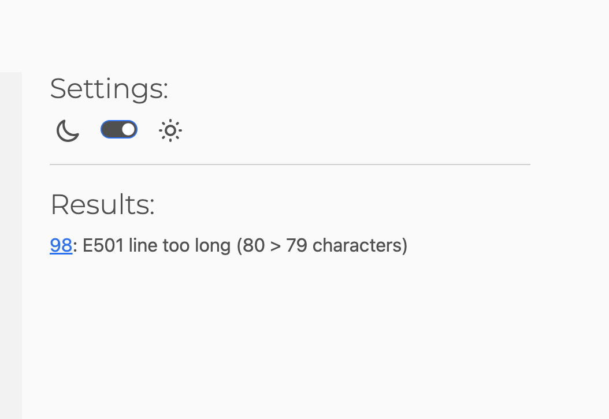

# Rock Paper Scissors Game (R-P-S)(https://r-p-s-final-project-27a267847406.herokuapp.com/)

## Overview

This is a console based game of rock,  paper, scissors implemented in python. 
The game allows the player to play against the computer by selecting the following options : rock/paper/scissors

## How to Play

1. Run the "run.py" file
2. Follow the instructions to choose your move (rock, paper, or scissors).
3. The computer will randomly select its move.
4. The game will display the result (win, lose, or tie) and update the scores.
5. You can choose to play another round or quit.

### Game Rules 

- Rock smashes Paper
- Paper covers Rock
- Scissors cut Paper

### Helper Functions

In the game logic, the following helper functions are called. 

1. display_rules(): This function displays the rules of the game to the user.

2. get_computer_move(): This function randomly selects a move for the computer player from the list of available moves: rock, paper, or scissors.

3. get_your_move(): This function prompts the user to input their move (rock, paper, or scissors) and validates the input to ensure it is one of the valid options.

4. display_results(computer_move, your_move): This function compares the moves of the computer player and the user player and prints the result of the game: whether it's a tie, the user wins, or the computer wins.

These functions encapsulate specific tasks within the game and help to organize the code by breaking it down into smaller, more manageable parts.

### Edge Cases

1. **Empty Input**: If the player enters nothing when prompted for their move, they will be asked to provide an answer.
2. **Invalid Input**: If the player enters an invalid move (anything other than rock, paper, or scissors), they will be prompted to read the game rules again.
3. **Tie**: If both the player and the computer select the same move, the game will declare a tie.
4. **Case Sensitivity**: Input is not case-sensitive. "rock", "Rock", and "ROCK" are considered same inputs.
5. **Quitting**: During the game, if the player enters 'q' when asked if they want to play another round, the game will terminate.

### Testing 

The manual testing for the the app was done in the following ways :
1. 1. **Testing for Game Initialisation** :

2. **Testing for Empty Input** :

3. **Testing for Invalid Input** :

3. **Testing for function i.e get_computer_move** :

 Here the logic was tested to prove the function provides random choice by running the function in isolation for 10 consecutive times. 

 Here the testing was done to ensure scores are getting incremented correctly for player or computer based on the choices made.

5. **Testing for Exiting Game** :

 Here testing was done to ensure exiting from the game is possible for the user and the user is shown a goodbye message.

### Bugs

There were various bugs in the game but thankfully now the game runs bug free in the production.

Major bugs were:

1. When the player won the round, the computer score was getting incremented :
 The arguments were passed to the function display_results() in the wrong order as a result the code was executing wrongly.
 
 2. The break statement for exiting the game was breaking the game at the wrong time due to poor use of the break statement.

 3. Indentation errors while writing the  function game_flow() was returning an error.

 4. Declaring the variable Opponent_move but using it as "opponent_move" was giving an error on line 81.

 5. The results after passing the code throught python linter is : 

 

 This project was deployed using Code Institute's mock terminal for Heroku, wish was provided by the code institute python-essentials-template.

### Deployment

Steps taken for deployment:

1. Create a new Heroku app
2. added config var(PORT, 8000)
3. Set the buildbacks to Python and NodeJS in that order
4. Link the Heroku app to the the Github repository (https://github.com/samiksha-92/r-p-s-final-project)
5. Enabled manual deployment from main branch
6. Click on Deploy

## Credits

1. I would like to thank my mentor Mr. Jack Wachira for challenging me to think about various aspects of the game and building a better game.
2.  I would like to thank my husband Mr. Dushyant Sabharwal for his support and inputs/feedback on the game which also led to a better outcome.
3.  Also, thankyou to realpython.com from where I understood the flow of the game. 
4.  All the code for this game is written solely by me. 
5. CI Assessors who provided a detailed assessment on where the project lacked depth.